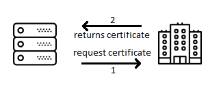

Is Encryption necessary?
===================

I'm surprise how people underestimate the importance of secure connections, from Industrial Systems to Call Centers, the majority of industries trust that network security is enough.

We all agree that network security when done right is perfect, well, most of the time. The catch is that security is an ongoing job and a simple misconfigured firewall could open a door for enough time for intruders to get in.

Once the network is compromise, it is just a matter of time for hackers to scan and find backdoors. Once a malicious software is running within the network, messages could be intercept and even replace by completely new ones.

Encryption
--------------

Most IT infrastructure like emails, browsers and instant message, use Transport Layer Security (`TLS`). TLS adds another level of security, where messages can **only** be understood by the destinatary. Let's see how it works.

TLS consists in a set of passwords. The first password is provided to the message source so that they can encrypt the message to be sent, and a second password used by the destination to decipher the received message. For instance:

Let's assume that **Alice** wants to send the message to **Bob**   
**Alice** uses **Bob**'s provided password to encrypt a message  

 

When **Bob** receives the message   
**Bob** decrypts the message using the second password that only he knows

 

Trust Connection
--------------

There's another problem, so far everything works perfectly once the connection has been established. However, we still need to face the handshake phase.  

Computers are just IP addresses, e.g. `172.217.9.78`, which use routing services to move packages across the network. But, how can you be sure that you are connecting to the right party on the other side of the network? 

Digital certificates are used to overcome this limitation. 

Certificates are created by a Certificate Authority, a mutually trusted third party that confirms the identity of the application. **VeriSign** and **GoDaddy** are two of the most popular Certificate Authorities. With these certificates any third party can confirm the destination's identity as follows:

**Bob** asks **Charlie** for a new certificate

When **Alice** wants to connect to **Bob**  
**Alice** asks **Bob** for his certificate   
**Bob** returns the certificated created by **Charlie**  
**Alice** confirms with **Charlie** that the certificate is authentic  

Now, applications don't care to what they are connecting to, as long as the right certificate is provided. 

Original Icons made by [Madebyoliver](https://www.flaticon.com/authors/madebyoliver)
