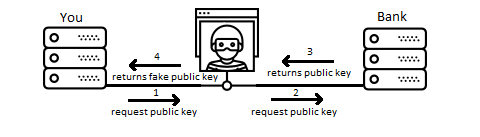

Is Encryption necessary?
===================

I'm surprise how people underestimate the importance of secure connections, from Industrial Systems to Call Centers, the majority of industries trust that network security is enough.

We all agree that network security when done right is perfect, well, most of the time. The catch is that security is an ongoing job and a simple misconfigured firewall could open a door for enough time for intruders to get in.

Once the network is compromise, it is just a matter of time for hackers to scan and find backdoors. Once a malicious software is running within the network, messages could be intercept and even replace by completely new ones.


Encryption
--------------

Most IT infrastructure like emails, browsers and instant message, use Transport Layer Security (`TLS`). TLS adds another level of security, where messages can **only** be understood by the destinatary. Let's see how it works.

TLS consists in a set of passwords.  
The public password is provided to the source so that they can encrypt the message to be sent 

 

The private password is used by the destination to decipher the received message

 

For instance:  

```
Let's assume that Dave wants to buy something online  
He gives his home address to the online store  
The Store sends the product to his home  
```

We could assume that anybody with Dave's home address can send him packages, however, only people living in that address should be able to receive the packages


Trust Connection
--------------

There's another problem, so far everything works fine once the connection has been established, in other words, the delivery guy knows exactly where the house is located.

Computers are located by IP addresses, e.g. `172.217.9.78`, which use routing services to move packages across the network. 



For example:  

```
You go to a new city, rent a car and setup the GPS to your hotel  
Half way there, the GPS promps you to turn left but there is no interception
You realized that the GPS is outdate  
You wonder around until you see a gas station  
You ask for directions to your hotel  
```

We could assume people on the gas station is trustworthy, but there could be people that will give you direcctions to a fake hotel


Digital certificates are used to overcome this limitation. 

Certificates are created by a Certificate Authority, a mutually trusted third party that confirms the identity of the application. **VeriSign** and **GoDaddy** are two of the most popular Certificate Authorities. With these certificates any third party can confirm the destination's identity as follows:

```
The hotel contacts the travel agency and ask for a pin number  
When customers arrive to the hotel 
They will ask the hotel for the pin number  
Customers will call the travel agency and confirm that the pin number is still valid  
```


Now, applications don't care to what they are connecting to, as long as the right certificate is provided. 


Original Icons made by [Madebyoliver](https://www.flaticon.com/authors/madebyoliver) and [Eucalyp](https://www.flaticon.com/authors/eucalyp)
